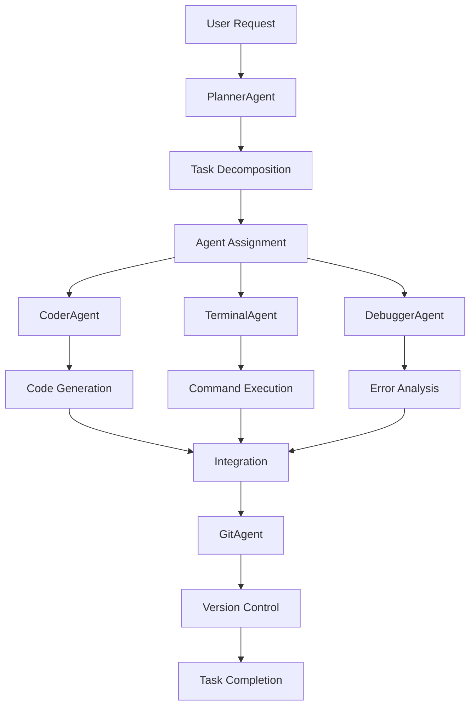

# 🧠 GodDevX System Overview

**Ultra-autonomous, offline-capable AI development assistant platform**

## 🎯 Mission Statement

GodDevX is a complete autonomous developer assistant that operates entirely offline using local LLMs. It features multi-agent orchestration, self-healing capabilities, and comprehensive development tools to provide a fully autonomous coding experience.

## 🏗️ System Architecture

### Core Components

```
┌─────────────────┐    ┌─────────────────┐    ┌─────────────────┐
│   LLM Engine    │    │  Agent System   │    │ Memory System   │
│                 │    │                 │    │                 │
│ • Ollama Client │    │ • Multi-Agent   │    │ • ChromaDB      │
│ • ReAct Prompts │    │ • Orchestrator  │    │ • Embeddings    │
│ • Function Call │    │ • Message Bus   │    │ • Context RAG   │
└─────────────────┘    └─────────────────┘    └─────────────────┘
         │                       │                       │
         └───────────────────────┼───────────────────────┘
                                 │
┌─────────────────┐    ┌─────────────────┐    ┌─────────────────┐
│ Execution Env   │    │  Tool System    │    │   UI Layer      │
│                 │    │                 │    │                 │
│ • Docker Sandbox│    │ • Code Parser   │    │ • FastAPI       │
│ • Terminal      │    │ • File Manager  │    │ • WebSocket     │
│ • Security      │    │ • Git Tools     │    │ • React UI      │
└─────────────────┘    └─────────────────┘    └─────────────────┘
```

## 🤖 Agent System

### Specialized Agents

1. **🧠 PlannerAgent**
   - Task decomposition and planning
   - Dependency analysis
   - Resource estimation
   - Project coordination

2. **💻 CoderAgent**
   - Code generation and modification
   - Refactoring and optimization
   - Code review and analysis
   - Multi-language support

3. **🔧 TerminalAgent**
   - Command execution in sandbox
   - Package management
   - Build system integration
   - Process monitoring

4. **🐞 DebuggerAgent**
   - Error analysis and diagnosis
   - Automatic bug fixing
   - Performance optimization
   - Code quality improvement

5. **📚 GitAgent**
   - Version control operations
   - Branch management
   - Commit automation
   - Merge conflict resolution

6. **💾 MemoryAgent**
   - Context management
   - Information storage/retrieval
   - Conversation history
   - Knowledge organization

7. **🔍 SearchAgent**
   - Code search and analysis
   - Pattern matching
   - Dependency tracking
   - Reference finding

### Agent Coordination



## 🧠 LLM Integration

### Supported Providers
- **Ollama**: Primary local LLM provider
- **llama.cpp**: Direct model integration
- **Future**: OpenAI API, Anthropic, etc.

### Recommended Models
- **mixtral:8x7b**: Best overall performance
- **llama3:8b**: Good balance of speed/quality
- **openchat:7b**: Fast and efficient
- **codellama:7b**: Specialized for code

### Prompt Engineering
- **ReAct Framework**: Reasoning + Acting pattern
- **Function Calling**: Structured tool usage
- **Context Assembly**: Dynamic prompt building
- **Memory Integration**: RAG-enhanced responses

## 💾 Memory System

### Vector Storage
- **ChromaDB**: Primary vector database
- **Local Embeddings**: sentence-transformers
- **Persistent Storage**: File-based persistence
- **Context Retrieval**: Semantic search

### Memory Types
- **Conversation History**: Chat context
- **Code Context**: File and function context
- **Task Memory**: Project-specific information
- **Knowledge Base**: General programming knowledge

## 🔧 Execution Environment

### Sandboxed Execution
- **Docker Integration**: Isolated containers
- **Security Policies**: Command filtering
- **Resource Limits**: Memory and time constraints
- **Network Controls**: Optional isolation

### Tool Integration
- **File Management**: Safe file operations
- **Code Parsing**: Tree-sitter AST analysis
- **Git Operations**: Version control automation
- **Test Running**: Automated testing

## 🛡️ Security Features

### Privacy Protection
- **Offline Operation**: No external API calls
- **Local Processing**: All data stays local
- **Encrypted Storage**: Optional data encryption
- **Access Controls**: Fine-grained permissions

### Execution Safety
- **Command Filtering**: Dangerous command blocking
- **Path Restrictions**: Filesystem access limits
- **Resource Monitoring**: CPU/memory usage tracking
- **Timeout Controls**: Execution time limits

## 📊 Performance Characteristics

### Benchmarks
- **Task Planning**: 2-5 seconds
- **Code Generation**: 10-30 seconds
- **Error Analysis**: 5-15 seconds
- **Memory Retrieval**: 100-500ms

### Resource Requirements
- **Minimum**: 8GB RAM, 4 CPU cores
- **Recommended**: 16GB RAM, 8 CPU cores
- **Storage**: 10GB for models and data
- **GPU**: Optional, improves LLM speed

## 🚀 Deployment Options

### Local Development
```bash
# Clone and setup
git clone <repository>
cd goddevx
pip install -r requirements.txt

# Start Ollama
ollama pull mixtral:8x7b

# Run system
python main.py
```

### Docker Deployment
```bash
# Complete stack
docker-compose up -d

# View logs
docker-compose logs -f goddevx
```

### Production Setup
- **Load Balancing**: Multiple agent instances
- **Monitoring**: Performance and health checks
- **Backup**: Memory and configuration backup
- **Updates**: Rolling model updates

## 🔮 Roadmap

### Phase 1: Core Platform ✅
- [x] Multi-agent architecture
- [x] LLM integration
- [x] Memory system
- [x] Basic tools
- [x] Security framework

### Phase 2: Enhanced Features
- [ ] Web UI dashboard
- [ ] VS Code extension
- [ ] Advanced debugging
- [ ] Plugin system
- [ ] Performance optimization

### Phase 3: Enterprise Features
- [ ] Multi-user support
- [ ] Team collaboration
- [ ] Advanced analytics
- [ ] Custom model training
- [ ] Enterprise security

### Phase 4: Ecosystem
- [ ] Marketplace for agents
- [ ] Community plugins
- [ ] Model fine-tuning
- [ ] Integration APIs
- [ ] Mobile companion

## 📈 Success Metrics

### Functionality
- ✅ **Agent Coordination**: Multi-agent workflows
- ✅ **Code Generation**: High-quality code output
- ✅ **Error Handling**: Automatic bug detection/fixing
- ✅ **Memory Integration**: Context-aware responses
- ✅ **Security**: Safe execution environment

### Performance
- ✅ **Response Time**: Sub-second for simple tasks
- ✅ **Accuracy**: High-quality code generation
- ✅ **Reliability**: Consistent operation
- ✅ **Scalability**: Handle complex projects
- ✅ **Efficiency**: Optimal resource usage

## 🤝 Contributing

### Development Setup
```bash
# Fork repository
git clone https://github.com/your-username/goddevx.git

# Install dependencies
pip install -r requirements-dev.txt

# Run tests
pytest

# Start development
python demo.py
```

### Architecture Guidelines
- **Modularity**: Keep components loosely coupled
- **Extensibility**: Design for easy extension
- **Security**: Security-first approach
- **Performance**: Optimize for speed and efficiency
- **Documentation**: Comprehensive documentation

---

**GodDevX** - The future of autonomous software development is here.

*Built with ❤️ for developers who want to focus on creativity, not repetitive tasks.*